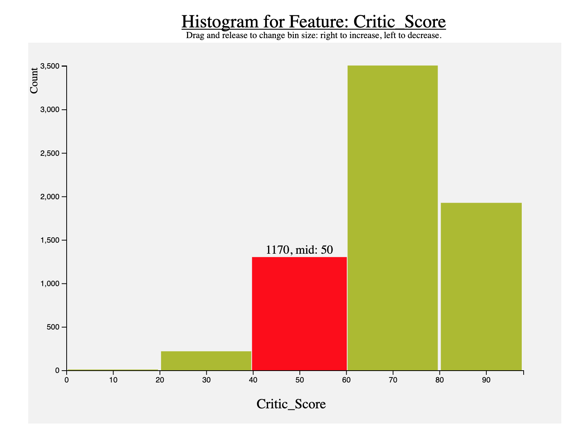

## Videogame Dataset Visualization


[Vizualization Demo](https://youtu.be/J2BHoFvJCpk)

## About the Project

[Videogame Sales Dataset](https://www.kaggle.com/rush4ratio/video-game-sales-with-ratings)

**Numerical Features:** 'Year_of_Release', 'NA_Sales', 'EU_Sales', 'JP_Sales', 'Other_Sales', 'Global_Sales', 'Critic_Score', 'Critic_Count', 'User_Score', 'User_Count'.

**Categorical Features:** 'Rating', 'Platform', 'Publisher', 'Genre', 'Developer'.

After data preprocessing, the final clean dataset had 6825 entries and 15 features.

## Implementation

1. Visualizing Numerical Features as Histograms. Bin size can be changed by dragging mouse left or right on the image. Hovering over a bar will select the bar and show the count on top.





2. Visualizing Categorical Features as Bar Charts. Hovering over a bar will show the details on top.


## How to Run

Go inside the code folder and create a python server with the command below. On clicking the link you will be directed to the main 'index.html' file.

```
python3 -m http.server
```
